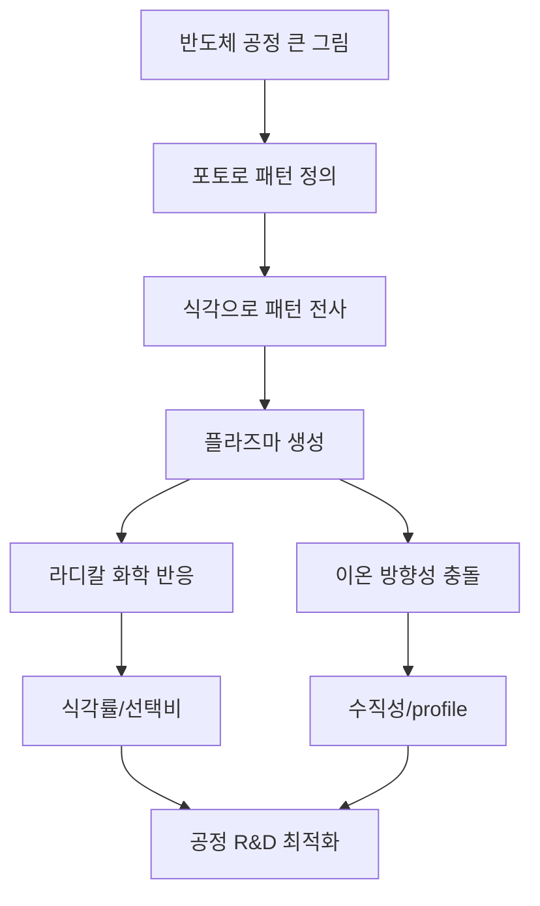

# 반도체 공정 R&D와 플라즈마 식각 입문

## 이 묶음의 목적

원자핵공학과에서 배운 플라즈마 이론을 출발점으로, **SK하이닉스 공정 R&D 직무에서 말하는 반도체 공정과 플라즈마 식각**을 이해하기 위한 입문 지식 그래프입니다.

핵심 관점은 다음 한 문장입니다.

> 플라즈마 식각은 “웨이퍼 위의 매우 작은 패턴을 원하는 깊이와 모양으로 깎기 위해, 반응성 라디칼의 화학 반응과 이온의 방향성 충돌을 동시에 제어하는 공정”입니다.

## 먼저 잡아야 할 큰 그림

반도체 제조는 대략 다음 순환을 반복합니다.

1. 박막을 쌓는다: 증착 또는 산화
2. 빛으로 모양을 그린다: 포토리소그래피
3. 그 모양대로 깎거나 바꾼다: 식각, 이온주입 등
4. 표면을 평탄화하거나 세정한다: CMP, 세정
5. 검사하고 조건을 다시 조정한다: 계측, 수율 분석

이 중 플라즈마는 특히 **건식 식각**에서 중요합니다. 포토 공정이 “어디를 남기고 어디를 제거할지”를 정하면, 식각 공정은 실제 재료를 제거해 그 패턴을 아래층으로 전사합니다.

## 이 묶음의 추천 학습 순서

1. [[웨이퍼에서 소자까지 반도체 공정 큰 그림]]
2. [[식각 공정과 패턴 전사]]
3. [[플라즈마 기초를 공정 언어로 번역하기]]
4. [[플라즈마 식각 장비와 조절 변수]]
5. [[플라즈마 식각의 물리와 화학 메커니즘]]
6. [[공정 R&D 엔지니어가 보는 지표와 실험 설계]]
7. [[SK하이닉스 공정 R&D 지원자 관점 정리]]

## 원자핵공학 배경과 연결되는 부분

| 배운 개념 | 공정 식각에서 다시 등장하는 형태 |
|---|---|
| 플라즈마 준중성 | bulk plasma의 전자/이온 밀도 균형 |
| Debye length | sheath 두께와 벽 근처 전위 구조 |
| sheath | 이온이 웨이퍼로 가속되는 영역 |
| 전자온도 | 해리, 이온화, 라디칼 생성 효율 |
| 충돌 단면적 | 가스 압력, 평균자유행로, 반응 확률 |
| RF 전기장 | 플라즈마 유지와 이온 에너지 제어 |

다만 공정 R&D에서는 이론 자체보다 **“어떤 노브를 바꾸면 식각률, 선택비, profile, damage가 어떻게 변하는가”**가 더 중요합니다.

## 전체 구조 한눈에 보기

## 면접/자소서에서 쓸 수 있는 요약 문장

> 저는 플라즈마 이론에서 배운 sheath, 전자온도, 충돌 및 에너지 전달 개념을 바탕으로, 식각 공정에서 이온 에너지와 라디칼 flux가 식각률, 선택비, CD, profile 및 damage에 미치는 영향을 공정 변수 관점에서 이해하고 확장해 나가고자 합니다.

## 이 묶음 안의 관련 노트

- [[웨이퍼에서 소자까지 반도체 공정 큰 그림]]
- [[식각 공정과 패턴 전사]]
- [[플라즈마 기초를 공정 언어로 번역하기]]
- [[플라즈마 식각 장비와 조절 변수]]
- [[플라즈마 식각의 물리와 화학 메커니즘]]
- [[공정 R&D 엔지니어가 보는 지표와 실험 설계]]
- [[SK하이닉스 공정 R&D 지원자 관점 정리]]
